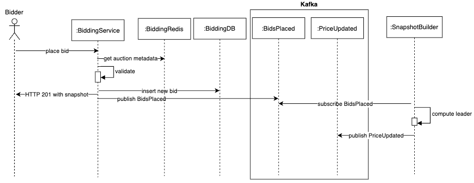
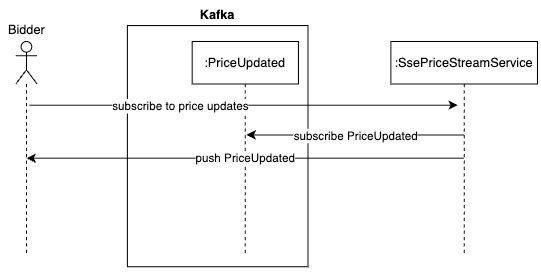
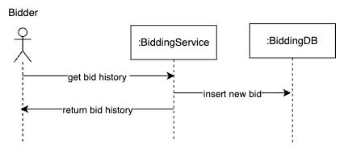
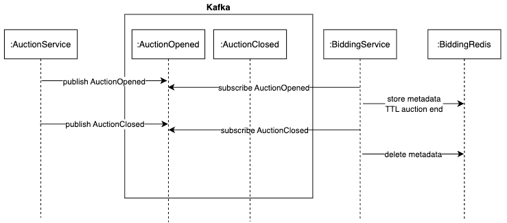
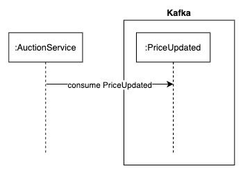

# Bidding Services

## About the Project

## Project Structure
```
├── generated-client
├── openapi
│   ├── bid-command
│   └── bid-query
├── pkg
├── scripts
│   └── seed
└── services
    ├── auction-projector
    │   ├── cmd
    │   └── internal
    │       ├── events
    │       ├── projections
    │       │   └── redis
    │       └── projector
    ├── bid-command
    │   ├── cmd
    │   ├── internal
    │   │   ├── application
    │   │   ├── domain
    │   │   ├── infrastructure
    │   │   │   ├── cache
    │   │   │   ├── db
    │   │   │   └── mq
    │   │   ├── presentation
    │   │   └── server
    │   ├── openapi
    │   └── sqlc
    │       ├── queries
    │       └── schema
    ├── bid-projector
    └── bid-query
        ├── cmd
        ├── internal
        │   ├── application
        │   ├── infrastructure
        │   │   ├── db
        │   │   │   └── read_repo
        │   │   └── mq
        │   ├── presentation
        │   └── server
        └── openapi
```
## Design

### High Level Architecture


### Use Cases

#### Place Bid



#### Get Live Price Updates


#### Get Bid History



### Interactions

#### AuctionOpened & AuctionClosed events
Subscribes to AuctionOpened and AuctionClosed events. 

On AuctionOpened the BiddingService stores the auction metadata in its cache. On AuctionClosed the BiddingService deletes the auction metadata from its cache.



#### Auction Service

Subscribes to PriceUpdated events. Stores snapshot for use on Auction EndAt to trigger payments



## Documentation

### OpenAPI
- [Bidding Service OpenAPI](docs/openapi/bidding-service.yaml)

## Setting Up

### Prerequisites

### Run

### Docker

```bash
open -a Docker

docker compose down --remove-orphans 
docker compose up -d --build

docker compose up --build

curl -f http://localhost:8081/healthz
curl -f http://localhost:8081/readyz


curl -f http://localhost:8083/healthz
curl -f http://localhost:8083/readyz
```

### Kafka-UI

Kafka-UI: http://localhost:8080
Swagger UI: http://localhost:8081/swagger/openapi/
Swagger UI: http://localhost:8083/swagger/openapi/