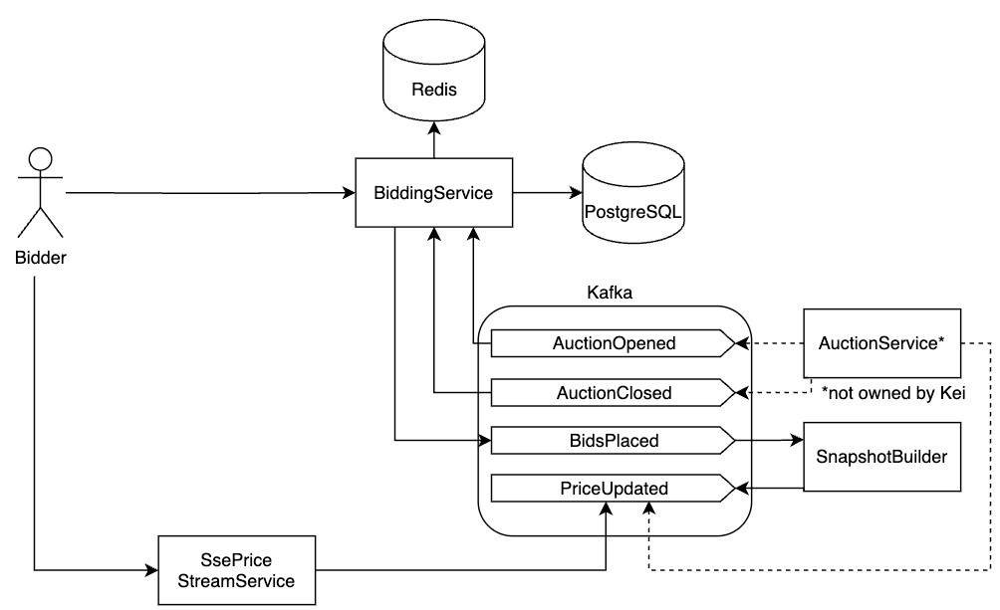
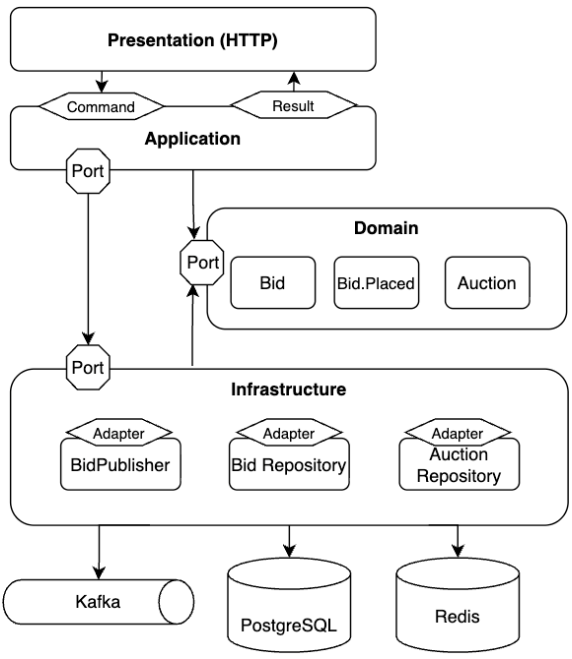
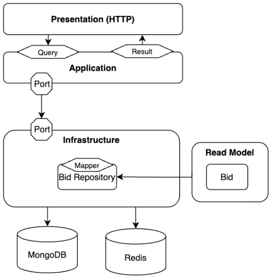
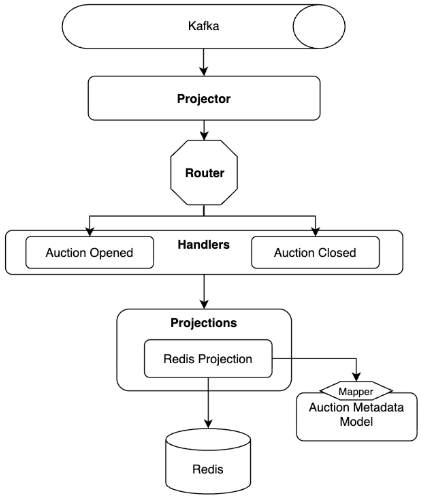
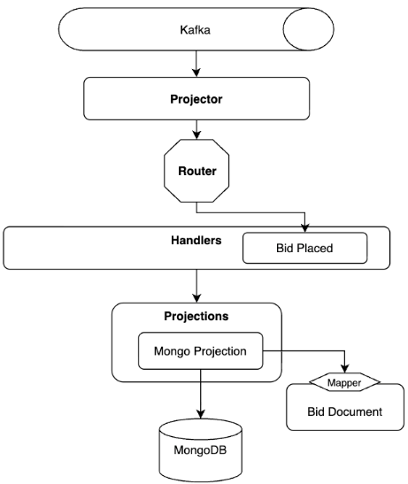

# Bidding Services

## About
This repository contains the services for the bidding bounded context and projector services.

The bidding bounded context has been split into command and query services, following the CQRS pattern.
The Projector Services tier is decomposed into two subsystems and are responsible for consuming domain events from Kafka and maintaining their respective materialized views.


## Table of Contents

- [Project Structure](#project-structure)
- [Design](#design)
    - [High Level Architecture](#high-level-architecture)
    - [Service Design](#service-design)
        - [Bid Command Service](#bid-command-service)
        - [Bid Query Service](#bid-query-service)
        - [Auction Projector](#auction-projector)
        - [Bid Projector](#bid-projector)
    - [Key Architecture Decisions](#key-architecture-decisions)
        - [CQRS Pattern](#cqrs-pattern)
        - [Polyglot Persistence (MongoDB, PostgreSQL)](#polyglot-persistence-mongodb-postgresql)
        - [Projector services for Domain Events](#projector-services-for-domain-events)
        - [Event Streaming with Apache Kafka](#event-streaming-with-apache-kafka)
        - [Not using 2PC or Transactional Outbox pattern](#not-using-2pc-or-transactional-outbox-pattern)
        - [Observability: Prometheus, Prometheus Alarms, and Grafana](#observability-prometheus-prometheus-alarms-and-grafana)
- [Run Locally (Mac)](#run-locally-mac)
- [Links](#links)

## Project Structure
```
├── docker-compose.yaml
├── generated-client
├── grafana
├── openapi
│   ├── bid-command
│   └── bid-query
├── pkg
├── prometheus.yml
├── qodana.yaml
├── scripts
├── services
│   ├── auction-projector
│   │   ├── Dockerfile
│   │   ├── cmd
│   │   └── internal
│   │       ├── events
│   │       ├── projections
│   │       └── projector
│   ├── bid-command
│   │   ├── Dockerfile
│   │   ├── cmd
│   │   ├── internal
│   │   │   ├── application
│   │   │   ├── domain
│   │   │   ├── infrastructure
│   │   │   ├── presentation
│   │   │   └── server
│   │   ├── openapi
│   │   └── sqlc
│   ├── bid-projector
│   │   ├── Dockerfile
│   │   ├── cmd
│   │   └── internal
│   │       ├── events
│   │       ├── projections
│   │       └── projector
│   ├── bid-query
│   │   ├── Dockerfile
│   │   ├── cmd
│   │   ├── internal
│   │   │   ├── application
│   │   │   ├── infrastructure
│   │   │   ├── presentation
│   │   │   ├── read_model
│   │   │   └── server
│   │   └── openapi
└── sqlc.yaml
```
## Design

### High Level Architecture


### Service Design

#### [Bid Command Service](services/bid-command)


Presentation Layer: Maps HTTP requests from OpenAPI schema to Application commands, basic input validation, and translates Application result/errors to HTTP status codes and OpenAPI schema  <br>
Application Layer: Implements the Place Bid use case. Coordinates domain objects and infrastructure via ports, but doesn’t know any concrete DB or MQ details. <br>
Domain Layer: Contains entities (Bid, Auction), domain events (Bid.Placed), and rules. Also defines the ports for the Application and Infrastructure layers. <br>
Infrastructure Layer: Provides adapters for persistence with postgreSQL and redis and for publishing domain events with Kafka <br>


#### [Bid Query Service](services/bid-query)


Presentation Layer: Maps HTTP requests from OpenAPI schema to Application commands, basic input validation, and translates Application result/errors to HTTP status codes and OpenAPI schema <br>
Application Layer: Implements the List Bids use case by invoking read-model bid repository through ports and also handles sorting/ cursor pagination logic <br>
Read Model: Stores denormalized, query-optimized view of bids used for listing and cursor pagination <br>
Infrastructure Layer: Implements MongoDB and Redis adapters that materialize, query, and cache the read model exposed through ports <br>


#### [Auction Projector](services/auction-projector)


Projector: Subscribes to Kafka topics, deserialises events and forwards them to the router <br>
Router: Maps events to handlers, rejects unsupported events <br>
Handlers: business logic for processing events like AuctionOpened <br>
Projections: Currently only one projection, redis projection. Populates the bid command service’s redis for fast lookup for authoritative checks  <br>

#### [Bid Projector](services/bid-projector)


Projector: Subscribes to Kafka topics, deserialises events and forwards them to the router  <br>
Router: Maps events to handlers, rejects unsupported events <br>
Handlers: business logic for processing events like BidPlaced <br>
Projections: Currently only one projection, MongoDB projection. Populates the bid query service’s MongoDB with denormalised bid documents for listing and cursor pagination <br>

### Key Architecture Decisions

#### CQRS Pattern
- Rationale:
  - Separation of Concerns: Different models for read and write operations
  - Independent Scaling
  - Performance Optimization: Tailored data storage and retrieval
- Trade-offs:
  - Increased Complexity: More services to manage and maintain
  - Data Consistency Challenges: Eventual consistency between read and write models
  
<br>
  
#### Polyglot Persistence (MongoDB, PostgreSQL)
- Rationale:
  - PostgreSQL
    - ACID transactions for bid command service
    - Strong consistency required for authoritative bid data
  - MongoDB
    - Flexible schema for bid read model
    - Easy to store denormalized bid documents for listing and cursor pagination
    - Horizontal scaling to handle large volumes of bid data
- Trade-offs: 
  - Operational complexity
  - More infrastructure to manage

<br>

#### Projector services for Domain Events
- Rationale:
  - Decouple consumption of events from Bidding query and command services
  - Enable simple fanout from projector services to future services like Opensearch, Notification service without touching Bidding CQRS services
- Trade-offs: Complexity, maintainability
- Alternatives Considered: Consuming events directly in the bidding CQRS

<br>

#### Event Streaming with Apache Kafka
Kafka is used as the central message bus for asynchronous communication between our microservices. Our services produce domain events for other services to consume. This decouples our services, allowing them to evolve independently.
<br>
- Rationale:
  - At least once delivery
  - Ordering
  - Real-time, High-Throughput Data Flow
  - Strong durability and replication
  - Zero data lost on consumer failure <br>
- Trade-offs:
  - Atomic Transactions: complex to achieve need 2PC or transactional outbox pattern (future work - use GitHub - ihippik/wal-listener to mitigate this)
  - Maintainability: Kafka introduces significant operational overhead, need to monitor broker health, manage partitions, consumer groups, etc

<br>

#### Not using 2PC or Transactional Outbox pattern
- Rationale
  - Time constraints
  - Lower latency
  - Implementation complexity
  - Low probability of critical events dropping due to app being hosted on Fargate, which is regionally resilient
- Trade-offs
  - Low probability of critical events dropping
- Alternatives Considered: Using an open source WAL listener like GitHub - ihippik/wal-listener

<br>

#### Observability: Prometheus, Prometheus Alarms, and Grafana
Prometheus and Grafana is used for monitoring application and infrastructure metrics along with Prometheus Alarms for detecting critical issues (P99 Latency, high 5xx error rates, etc.)
- Rationale
  - Prometheus
    - powerful query language (PromQL)
    - many open source integrations (Grafana, OTel, Thanos)
  - Prometheus Alarms
    - leverages metrics from Prometheus
  - Grafana
    - seamless integration with Prometheus
    - dashboard allows us to quickly identify trends and bottlenecks
- Trade-offs
  - Operational Overhead and Costs
    - prometheus and grafana servers need to be managed
  - Long term storage
    - storing data long term in Prometheus is extremely expensive
    - careful data retention policies must be set, we might export data to a remote storage solution like Thanos

<br>


## Run Locally (Mac)

```bash
open -a Docker
docker compose up -d 
```

## Links
- [Kafka UI](http://localhost:8080)
- [Bid Command Swagger](http://localhost:8082/swagger/openapi/)
- [Bid Query Swagger](http://localhost:8083/swagger/openapi/)
- [Prometheus](http://localhost:9090)
- [Grafana Bid Platform Dashboard](http://localhost:3000/d/bid-platform/bid-platform-overview)
    - Username: admin
    - Password: admin


[//]: # (- Pprof )

[//]: # (go tool pprof -http=:8081 http://127.0.0.1:6062/debug/pprof/profile <br>)

[//]: # (go tool pprof -http=:8081 http://127.0.0.1:6062/debug/pprof/heap <br>)

<!--
[//]: # ()
[//]: # (## dev)

[//]: # ()
[//]: # (```bash)

[//]: # (docker exec -it kafka bash)

[//]: # ()
[//]: # (# open)

[//]: # (kafka-console-producer.sh --bootstrap-server kafka:9092 \)

[//]: # (--topic auction.opened --property parse.key=true --property key.separator=":")

[//]: # ()
[//]: # (a_seeded:{"auctionId":"a_seeded","endsAt":"2025-10-16T02:45:00Z","startingPrice":100,"minIncrement":10,"version":1})

[//]: # (b_seeded:{"auctionId":"b_seeded","endsAt":"2025-10-16T02:45:00Z","startingPrice":100,"minIncrement":10,"version":1})

[//]: # ()
[//]: # (# close)

[//]: # (kafka-console-producer.sh --bootstrap-server kafka:9092 \)

[//]: # (--topic auction.closed --property parse.key=true --property key.separator=":")

[//]: # (a_seeded:{"auctionId":"a_seeded","closedAt":"2025-10-16T03:00:00Z","version":2})

[//]: # (```)

[//]: # ()
[//]: # (```bash)

[//]: # (curl -X 'POST' \)

[//]: # (  'http://localhost:8082/api/v1/bids/a_seeded' \)

[//]: # (  -H 'accept: application/json' \)

[//]: # (  -H 'Content-Type: application/json' \)

[//]: # (  -d '{)

[//]: # (  "amount": 131.5,)

[//]: # (  "bidderId": "user_123")

[//]: # (}')

[//]: # (```)

[//]: # ()
[//]: # (```bash)

[//]: # (docker exec -it kafka bash)

[//]: # ()
[//]: # (# open)

[//]: # (kafka-console-producer.sh --bootstrap-server kafka:9092 \)

[//]: # (--topic auction.opened --property parse.key=true --property key.separator=":")

[//]: # ()
[//]: # (b_seeded:{"auctionId":"b_seeded","endsAt":"2025-10-16T02:45:00Z","startingPrice":100,"minIncrement":10,"version":1})

[//]: # (```)

[//]: # ()
[//]: # (docker compose up -d --build bid-command bid-query )